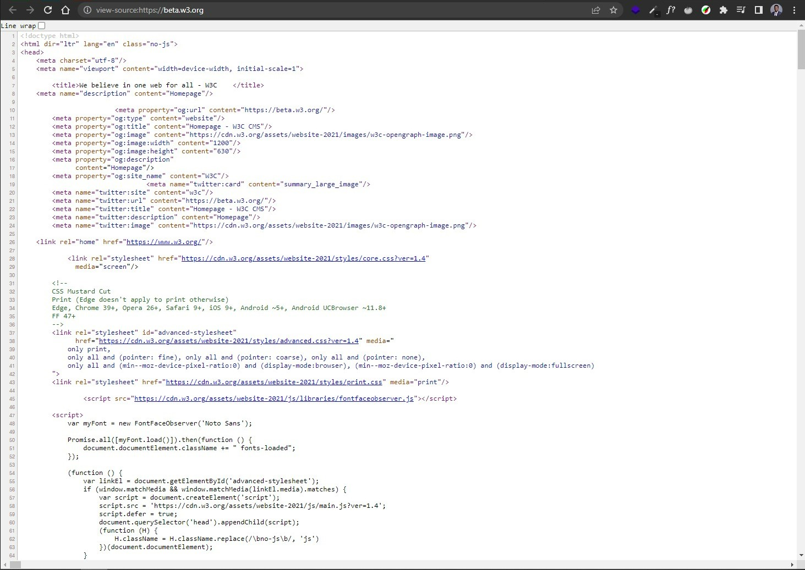
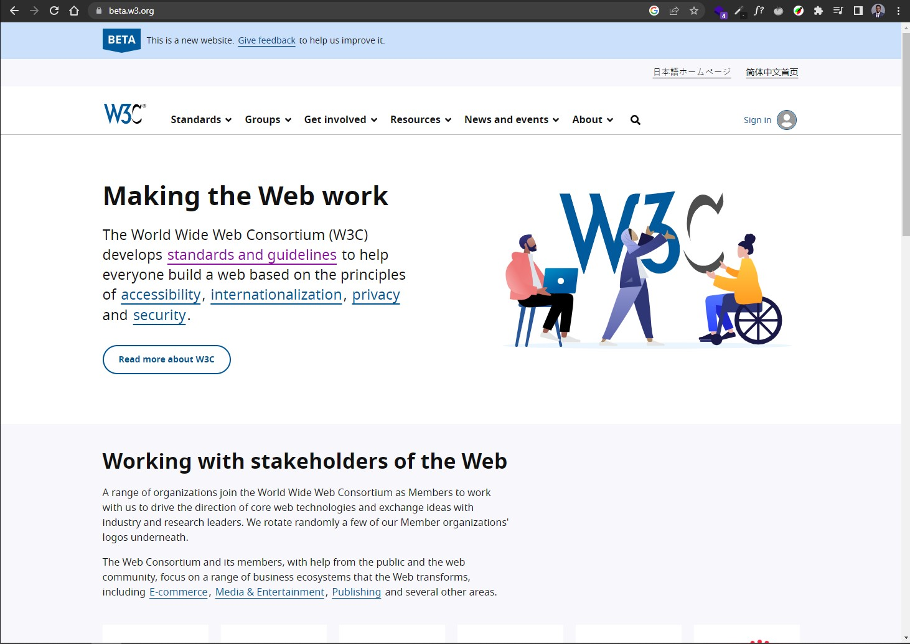

# Introduction to the Internet and the Web
{: .no_toc}

## Table of Contents
{: .no_toc .text-delta }

1. TOC
{:toc}

## The Internet

The Internet is a global system of interconnected computer networks that uses an Internet protocol suite called TCP/IP to communicate between networks and devices.[^1] It is a network of networks.

To put it simply, the internet is the global infrastructure that carries things like:

- Email
- The web
- File sharing
- Online gaming
- Streaming services

## The Web

The World Wide Web (WWW), or simply the **Web**, is an information space where documents and other resources are available over the Internet. 

These resources are identified by their global identifiers called Uniform Resource Identifier[^2] (URI) and are transferred through a protocol called HTTP. 

**Hyper Text Transfer Protocol (HTTP)** is a set of rules that codifies how communication should work on the web.  
An HTTP Request is sent to a server using a URL[^2], then the server responds with the resource requested. This process is called a request-response cycle; requests are made by **clients** and responses are sent by **servers**. 

For example, you can make an HTTP request with your browser (the client) with this URL -> <a href="https://picsum.photos/id/26/4209/2769.jpg" target="_blank">https://picsum.photos/id/26/4209/2769.jpg</a> to get an image resource. The web server gets the image from where it is stored (usually a storage server), and sends it to the browser. Then the browser displays it on a web page. 

> **Fun fact:** The first web browser, server, and web page was written by Tim Berners-Lee. He also wrote the first specifications for URLs, HTTP and HTML. 

## The Request-Response Cycle

You already made a request to get a picture from a server. The process of getting that picture is called the **request-response cycle**, where a client makes an HTTP request to a server and the server sends an HTTP response back to the client.

**Now what happens when you make a request for a webpage?**  
e.g. beta.w3.com

The request-response cycle is the same, except that the server does not respond with an image or a "ready-made" beautiful webpage. It responds with instructions or code that the browser can then turn into a beautiful webpage. 

{: .highlight }
> To view the instructions for a webpage, right click on any webpage in a browser and select View page source.

The browser takes the front-end code you see and turns it into a webpage that looks like this:

---

## Takeaways

- The Internet is a network of networks.
- The web is an information space on the Internet where images, text files, and other types of resources are available.
- A client is what makes an HTTP request to a server on the web.
- A browser is a type of client. 
- The server sends a response back to client with the requested resource, if available. 
- This process is the request-response cycle.

---

## Other Resources

- [World Wide Web Consortium (W3C)](https://www.w3.org/standards/)

## References

[^1]: Internet. (2023). In _Wikipedia._ [https://en.wikipedia.org/wiki/Internet](https://en.wikipedia.org/wiki/Internet)

[^2]: Sopha, M. (2022, December 21). _URI vs URL: Differences and When to Use Them._ Hostinger. [https://www.hostinger.com/tutorials/uri-vs-url](https://www.hostinger.com/tutorials/uri-vs-url#What_Is_URI)

<!-- Web page -> [^1]: Lastname, F. M. (Year, Month Date). _Title of page._ Site name. URL -->

<!-- Wikipedia -> [^1]: Title of article. (Year, Month Date). In _Wikipedia_. URL of archived version of page -->

<!-- Video -> [^1] Last Name, F. M. [Username]. (Year, Month Date). Title of video [Video]. Streaming Service. URL -->
