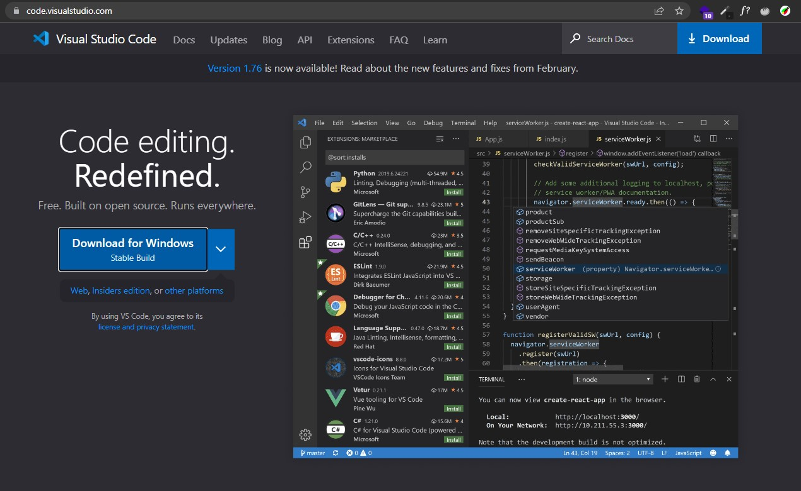
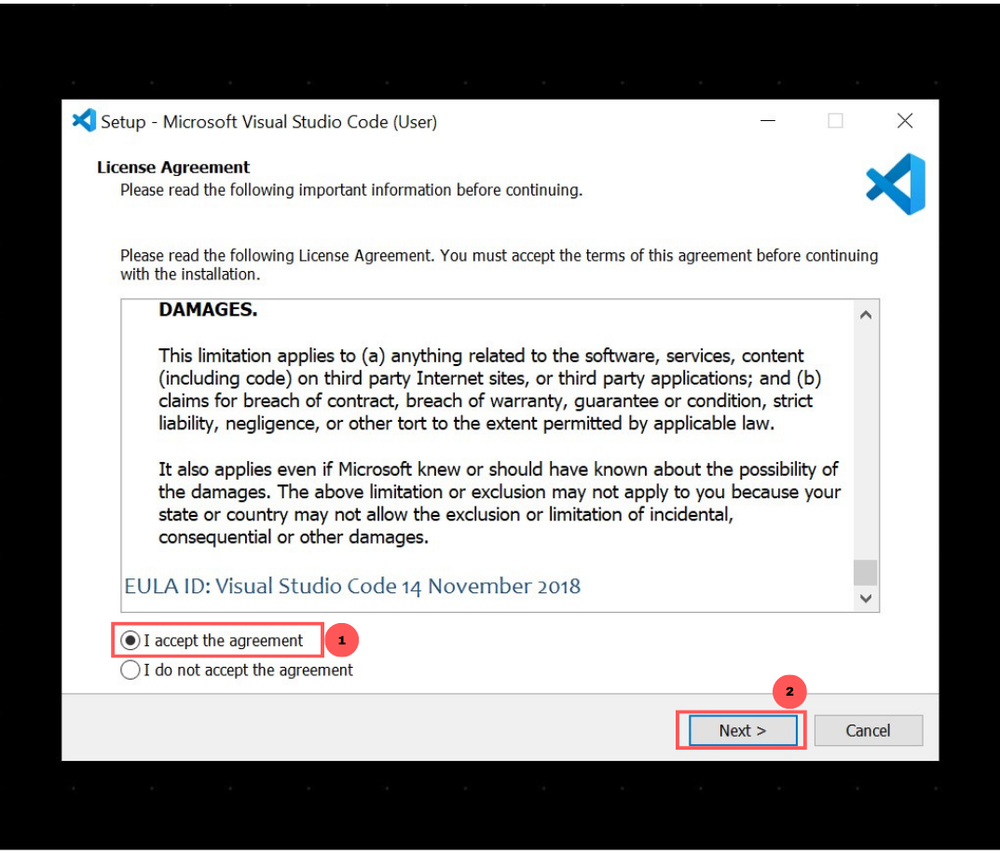
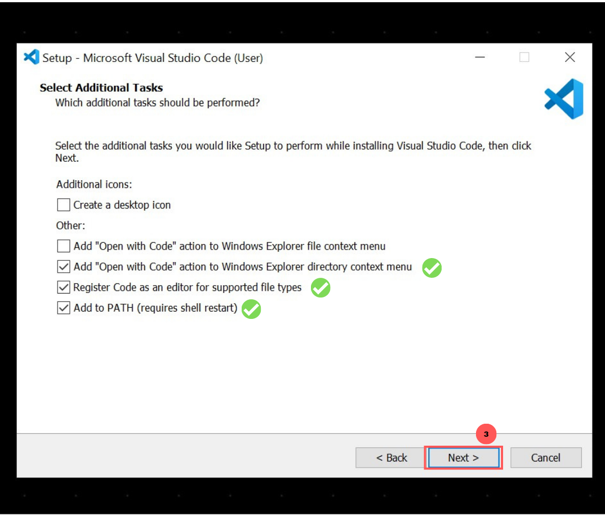
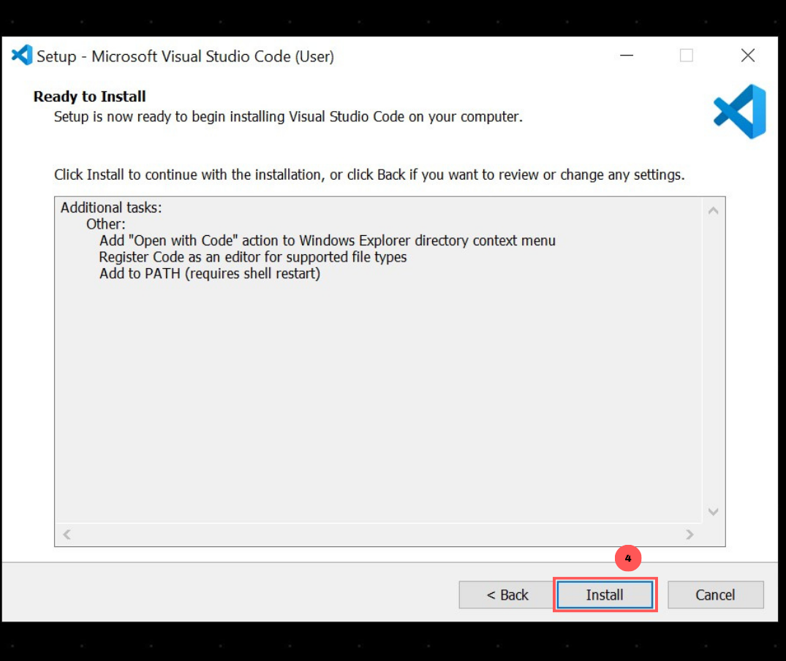
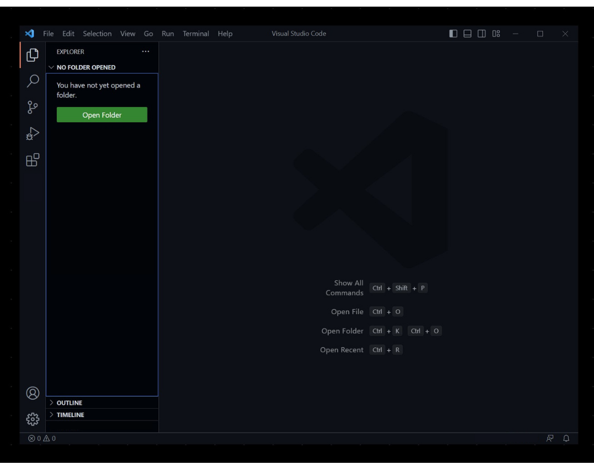

# How to set up Visual Studio Code
{: .no_toc}

{: .note}
> Visual Studio Code (VS Code) is different from Visual Studio.

## Table of Contents
{: .no_toc .text-delta }

1. TOC
{:toc}

## VS Code

Visual Studio Code (or VS Code) is free a code editing tool for different programming languages. 

We will use VS Code in this course. 

## Download installation file

Go to [https://code.visualstudio.com](https://code.visualstudio.com) and click **Download for Windows** _Stable Build_

- If you use MAC, download for MAC

## Install VS Code

1. Click on the installation file you just downloaded.
2. Accept terms and conditions and click next. 

3. Select these 3 options. 

4. Click install.

5. Open VS Code
