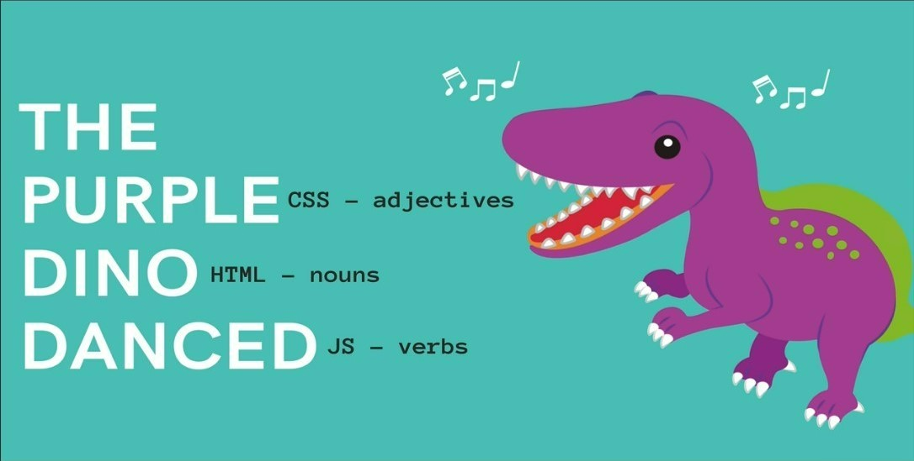

# Anatomy of a Webpage
{: .no_toc}

## Table of Contents
{: .no_toc .text-delta }

1. TOC
{:toc}

## What is Front end?

Front end is an collection of languages, frameworks, processes and tools that are used to create the graphic user interface (GUI) a user can interact with. 
Front end focuses on layout, animations, content organization, navigation and graphics. This is our focus in this course. 

**Front-end web development** is the development of visual elements of a website, with the use of HTML, CSS  and JavaScript. 

## What is Back end?

Back end is a collection of languages and tools that are used to create the instructions that run on a server.  
Back end focuses on building code, debugging, database management, security, backup, etc.

**Back-end web development** relies on programming languages like Java, C#, NodeJS, Python, Ruby, etc. to create server-side code.

{: .note-title}
> FRONTEND vs BACKEND illustration
> 
> Think of a restaurant. When you walk into the dining area, everything you interact with in that restaurant is in the front end. Then you make a request for vegetable salad to the waiter, who takes that request to the kitchen. The kitchen does some backend processes to make your salad, then gives it to the waiter who delivers it to you. 

In this scenario, you are the user. The dining area is the user interface. The waiter is the client who can make a request to the back end. The kitchen is the back end. The salad is the resource you requested.  
So, you ask the client for a resource. The client makes a request to the server. The server makes or gets your resource and gives it to the client to deliver to you. 

## HTML, CSS and JS

HTML, CSS and JS are the only languages that your browser understands. This course focuses on using these languages to create interactive webpages. 

HTML is a markup language for creating and structuring content.  
CSS is a styling language to style HTML content.  
JavaScript (JS) is a web programming language that can make elements on your webpage do things.

## Web Application Example

Here is a simple web application that shows the number of days, hours, minutes, and seconds to the next year. 

- [New Year Countdown Application](https://codepen.io/obaadelusi/pen/XWPVbYX){: target="_blank"}

{: .important}
> Inspect the HTML, CSS and JS editors in the application.

---

## Takeaways

- Front-end refers to how a webpage looks. It is the code that runs on a client to create visual elements. Also called client-side.
- Back-end refers to how it works. It is the code that runs on a server. Also called server-side. 
- HTML is for adding content to a page.
- CSS is for styling the content. 
- JS is for adding action or functionality to the elements on the webpage. 
